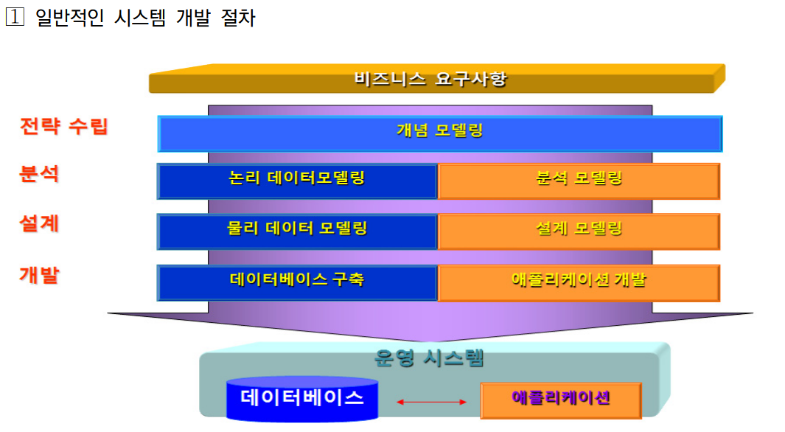
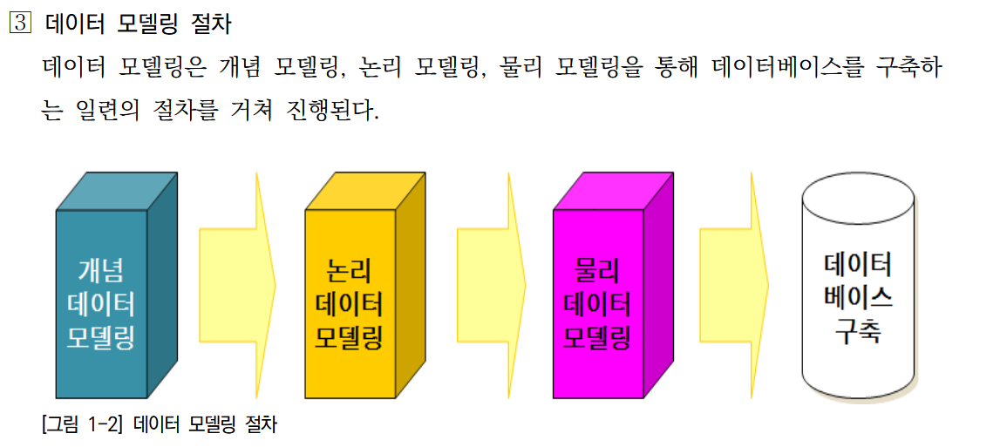
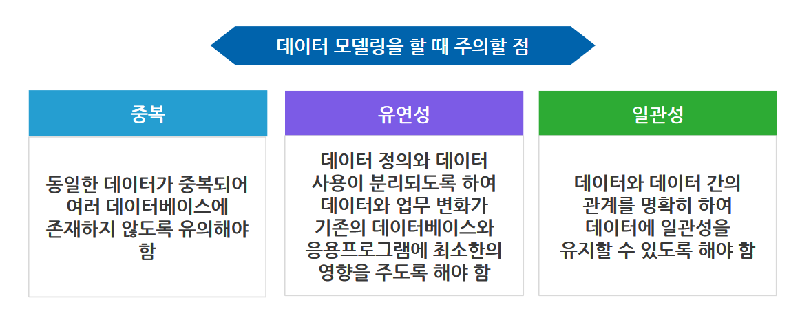

# 1. 데이터 모델링 정의(Data Modeling)
: **기업의 정보 구조를 실체(Entity)와 관계(Relation)를 중심으로 명확하고 체계적으로 표현하여 문서화하는 기법을 말한다.** 
+ 현실 세계의 데이터를 데이터베이스로 구축하기 위한 과정
+ 업무에 필요한 데이터 요구사항을 정의하고 분석하여, 간결하고 알기 쉽게 표현하는 과정

# 2. 데이터 모델링 목적
1. 연관 조직의 정보요구에 대한 정확한 이해를 할 수 있다.
2. 사용자, 설계자, 개발자 간에 효율적인 의사소통 수단을 제공한다.
3. 데이터 체계 구축을 통한 고품질 S/W 와 유지보수 비용의 감소효과를 기대할 수 있다.
4. 신규 또는 개선 시스템의 개발 기초를 제공한다.

# 3. 데이터 모델링 특성
1. **데이터 중심 분석** 을 통한 업무 흐름 파악이 용이하다.
2. 데이터 **무결성을 보장** 할 수 있다.
3. 데이터의 공유를 통한 **중복을 제거** 하고 **일관성** 있는 정보를 제공받을 수 있다.

# 데이터 모델링 절차
데이터 모델링은 **개념 모델링** => **논리 모델링** => **물리 모델링** 을 통해 **데이터베이스를 구축하는 일련의 절차를 거쳐 진행된다.** **또한, 필요지식 중 물리 데이터 모델링은 논리 모델을 적용하고자 하는 기술에 맞도록 상세화해 가는 과정입니다.**

## 데이터 모델링의 필요성
1. 약속된 표기법을 이용하여 전체 데이터베이스를 표현함 => 즉, 레시피가 음식을 만드는 과정을 보여주듯이 데이터 모델링을 통해 구축하고자 하는 전체 데이터베이스를 표현함
2. 데이터들 간의 관계를 바탕으로 업무 시스템을 설계하고 구축함 => 데이터 모델링 결과물을 이용하여 데이터베이스를 구축하지 않더라도 업무에 필요한 데이터들 간의 관계를 표현하기 때문에, 업무를 이해하는 데 도움을 줌
3. 서비스의 품질과 응용프로그램에 영향을 줌 => 데이터베이스 구조가 변경된다면 잘못된 데이터 모델링을 기반으로 작성한 응용프로그램까지 수정하게 되어 많은 시간과 비용이 발생

## 데이터 모델링을 할 때 주의할 점

## 데이터 모델링의 목적
1. **데이터 요구사항 파악** : 비즈니스 요구사항을 이해하고 데이터베이스에 저장되어야 할 데이터를 식별합니다. 이 단계에서 업무 프로세스, 사용자 요구사항, 데이터 속성 등을 고려합니다.
2. **데이터 구조 설계** : 데이터 요구사항을 기반으로 데이터 구조를 설계합니다. 이 단계에서 개체와 속성, 관계, 제약조건 등을 정의합니다. 일반적으로는 개체-관계(ER) 다이어그램이 사용됩니다.
3. **논리적 모델링** : 데이터 구조를 추상적으로 표현하는 단계입니다. 논리적 모델링에서는 업무 프로세스와 데이터 간의 상관관계를 나타내기 위해 특정 표기법(ex : ER 다이어그램)을 사용합니다. 이 단계에서는 데이터베이스 시스템의 종류와 독립적으로 데이터를 설계합니다.
4. **물리적 모델링** : 논리적 모델을 데이터베이스 시스템에 구현하기 위해 필요한 세부 사항을 추가합니다. 이 단계에서는 특정 데이터베이스 관리 시스템(DBMS)을 고려하여 테이블, 인덱스, 제약 조건 등을 설계합니다.

# 오라클 데이터 유형
1. **CHAR** : **고정길이** 문자열 DATA 최대 **2000바이트(Byte)** 까지 저장 가능
2. **VARCHAR2** : **가변길이** 문자열 DATA 최대 **4000바이트(Byte)** 까지 저장 가능
3. **NUMBER** : **38 자릿수** 의 숫자 저장가능
4. **DATE** : 날짜 값 저장
5. **BLOB**, **CLOB** : Binary, Text Data 최대 **4GB** 까지 저장 가능
    + **BLOB** (Binary Large Object): BLOB은 **2진 데이터, 즉 이미지, 동영상, 사운드 파일 등과 같은 이진 형식의 데이터를 저장하는 데 사용됩니다.** BLOB 열은 데이터베이스 내부에서 바이너리 형태로 저장되며, 일반적으로 파일 첨부, 멀티미디어 데이터, 바이너리 데이터 등을 저장하는 데 활용됩니다. BLOB 데이터는 크기가 크고 이진 형태이기 때문에 텍스트 데이터와는 다르게 색인화되지 않으며, 검색 및 분석 작업에는 특별한 처리가 필요합니다.
    + **CLOB** (Character Large Object): CLOB은 **텍스트 데이터, 즉 긴 문자열 데이터를 저장하는 데 사용됩니다.** CLOB 열은 데이터베이스 내부에서 문자 데이터로 저장되며, 일반적으로 긴 문서, HTML 페이지, XML 데이터, 대용량 문자열 등을 저장하는 데 활용됩니다. CLOB은 대부분의 문자 인코딩 방식을 지원하며, 대용량의 텍스트 데이터를 저장할 수 있습니다.

# 제약 조건 - Delete Constraint
: 참조된 기본키의 값이 삭제될 경우의 처리내용을 정의한다.
1. **Casecade** : 참조한 테이블에 있는 외부키와 일치하는 모든 Row 가 삭제된다.
2. **Restricted** : 참조한 테이블에 있는 외부키에 없는 것만 삭제 가능하다.
3. **Nullify** : 참조한 테이블에 정의된 외부키와 일치하는 것을 Null 로 수정한다.(해당 컬럼이 Null을 허용할 경우만)

# 오라클 무결성(Integrity)에 대한 정의
: **데이터베이스에서 무결성(Integrity)은 데이터의 일관성과 정확성을 보장하는 규칙과 제약 조건의 집합입니다. ▶ 무결성이란 데이터의 정확성과 일관성을 보장하며 잘못된 데이터에 입력이나 수정으로부터 데이터베이스를 보호하는 개념이다.** 
1. **개체 무결성(Entity Integrity)** : 개체 무결성은 테이블의 기본 키(Primary Key)를 통해 보장됩니다. 기본 키는 각 행을 고유하게 식별하는 역할을 수행하며, 기본 키 값은 NULL이거나 중복될 수 없습니다.
2. **참조 무결성(Referential Integrity)** : 참조 무결성은 외래 키(Foreign Key) 관계를 통해 보장됩니다. 외래 키는 다른 테이블의 기본 키를 참조하는 역할을 수행합니다. 참조 무결성은 외래 키 값이 참조된 테이블의 기본 키 값과 일치하거나 NULL이어야 함을 보장합니다.
3. **도메인 무결성(Domain Integrity)** : 도메인 무결성은 각 컬럼의 데이터 유형과 제약 조건에 대한 일관성을 보장합니다. 컬럼은 지정된 데이터 유형에 따라 정확한 값을 가져야 하며, NULL 값을 허용하는지 여부, 유일성 등의 제약 조건을 따라야 합니다.
4. **범위 무결성(Range Integrity)** : 범위 무결성은 특정 컬럼의 값이 정해진 범위 내에 존재해야 함을 보장합니다. 예를 들어, 날짜 컬럼의 값은 특정한 날짜 범위 내에 존재해야 하며, 숫자 컬럼의 값은 특정한 숫자 범위 내에 존재해야 합니다.
5. **고유성 무결성(Uniqueness Integrity)** : 고유성 무결성은 특정 컬럼의 값이 고유하게 유지되어야 함을 보장합니다. 즉, 중복된 값을 가질 수 없습니다. 고유성 무결성은 주로 고유 인덱스나 유니크 제약 조건을 통해 구현됩니다.  

*무결성은 데이터베이스 시스템의 중요한 특징 중 하나로, 데이터의 정확성과 일관성을 보장하여 신뢰성 있는 데이터 관리를 지원합니다. 제약 조건을 사용하여 데이터의 무결성을 강화하고, 데이터베이스 엔진이 잘못된 데이터 조작을 방지하여 데이터의 신뢰성을 유지할 수 있습니다.*

# JDBC 에서 오라클 저장프로시저 실행 방법(중요 객체)
1. 데이터 베이스 연결 : JDBC를 사용하여 오라클 데이터베이스에 연결합니다. 연결에 필요한 정보로는 데이터베이스 URL, 사용자 이름, 암호 등이 포함됩니다.

        Connection conn = OracleUtility.getConnection();

2. CallableStatement 준비 : 저장 프로시저를 호출하기 위해 CallableStatement 객체를 준비합니다. Connection.prepareCall() 메서드를 사용하여 **CallableStatement** 를 생성합니다. 프로시저 호출 구문은 **{ call 프로시저이름(매개변수1, 매개변수2, ...) }** 형태로 작성합니다.

        String sql = "{ call max_custom(?,?) }";	//저장 프로시저 max_custom 호출 sql. {} 안에서 호출하기
        CallableStatement cstmt = conn.prepareCall(sql);	
	    //prepareCall는 저장프로시저 실행하지 위한 객체 생성 메소드
    
3. 매개변수 설정 : 매개변수 인덱스, 오라클 데이터 타입 지정

        cstmt.registerOutParameter(1, Types.VARCHAR);	
	    cstmt.registerOutParameter(2, Types.NUMERIC);
        

4. 프로시저 실행 : **CallableStatement** 의 **execute()** 메서드를 호출하여 프로시저를 실행합니다. 결과가 반환되는 경우 **executeQuery()** 메서드를 사용하고, 결과가 반환되지 않는 경우 **executeUpdate()** 메서드를 사용합니다.

        cstmt.executeUpdate();	//실행

5. 결과 처리 : 저장 프로시저의 실행 결과에 따라 결과를 처리합니다. 프로시저가 반환하는 값이나 출력 매개변수가 있는 경우 **getXxx()** 메서드를 사용하여 결과를 가져올 수 있습니다.

        System.out.println("가장 많은 구매 수량으로 제품을 구입한 고객 정보");
	    System.out.println("고객 성명 : "+cstmt.getString(1));		//프로시저 출력값 첫번째 가져오기
	    System.out.println("고객 나이 : "+cstmt.getInt(2));			//프로시저 출력값 두번째 가져오기
        ┗> (1),(2) 은 출력 매개변수의 인덱스입니다.
        ┗> //IN 매개변수가 있으면 cstmt.setXXXX() 메소드로 값을 줍니다.

